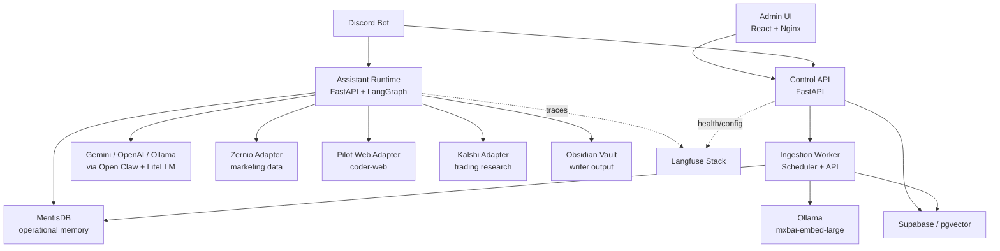

<p align="center">
  
</p>

<h1 align="center">PC Agent</h1>

[](VERSION)
[](services/assistant-runtime/requirements.txt)
[](services/control-api/app/main.py)
[](services/assistant-runtime/app/use_cases/marketing_graph.py)
[](docker-compose.yml)

PC Agent es una plataforma multiagente operada desde Discord para investigar,
crear, publicar, recordar y aprobar acciones sensibles con compuertas humanas.
Combina un runtime de agentes con LangGraph, una API de control, memoria vectorial,
memoria operativa, UI administrativa, observabilidad y workers de ingesta.

El objetivo del proyecto es simple: convertir Discord en una consola de operaciones
para subagentes especializados sin perder trazabilidad, configuracion ni control
humano sobre decisiones de alto impacto.

## Tabla De Contenido

- [Capacidades](#capacidades)
- [Arquitectura](#arquitectura)
- [Servicios](#servicios)
- [Inicio Rapido](#inicio-rapido)
- [Configuracion](#configuracion)
- [Comandos De Discord](#comandos-de-discord)
- [Memoria E Ingesta](#memoria-e-ingesta)
- [Seguridad Y Aprobaciones](#seguridad-y-aprobaciones)
- [Observabilidad](#observabilidad)
- [Validacion](#validacion)
- [Roadmap](#roadmap)

## Capacidades

- Bot de Discord con comandos, hilos por subagente, embeds, botones y flujos de aprobacion.
- Runtime de IA en FastAPI con acciones `chat`, `research`, `trade_decision`, `marketing`, `writer`, `picture` y `coder-web`.
- Grafo de marketing con LangGraph: contexto, vision, deteccion de intencion, critica, refinamiento de voz y aprobacion humana.
- Subagente Writer con salida a Obsidian para blogs y storytelling.
- Subagente Picture con memoria visual y soporte de imagenes adjuntas.
- Subagente Coder Web para crear o ajustar e-commerce y experiencias React/TS.
- Control API para estado del sistema, configuracion runtime, fuentes de conocimiento, ingestas y memoria diaria.
- Ingestion worker con scheduler, embeddings locales via Ollama y persistencia en Supabase/pgvector.
- Memoria proactiva por contexto: general, marketing, picture y coder-web.
- Observabilidad opcional con Langfuse.
- Stack local completo con Docker Compose.

## Arquitectura

PC Agent sigue un estilo Clean/Hexagonal: los casos de uso hablan con puertos de
dominio y las integraciones externas viven como adaptadores. Esto permite cambiar
LLMs, stores, APIs de marketing o conectores de trading sin reescribir los flujos.



### Capas

| Capa | Responsabilidad | Modulos principales |
| --- | --- | --- |
| Entrada | Discord, UI admin y endpoints HTTP | `services/discord-bot`, `ui`, `control-api/app/api` |
| Aplicacion | Casos de uso, grafos y orquestacion | `assistant-runtime/app/use_cases`, `control-api/app/application` |
| Dominio | Modelos, puertos y politicas | `assistant-runtime/app/domain`, `control-api/app/domain` |
| Adaptadores | LLMs, memoria, Supabase, Zernio, Kalshi, Pilot Web | `assistant-runtime/app/adapters`, `control-api/app/adapters` |
| Datos | Vector store, runtime config, Obsidian, memoria diaria | Supabase, pgvector, Docker volumes |
| Observabilidad | Trazas, errores y costos de LLM | Langfuse, LiteLLM callbacks |

## Servicios

| Servicio | Puerto | Descripcion |
| --- | ---: | --- |
| `control-api` | `8000` | Plano de control: health checks, configuracion, fuentes, ingestas y memoria. |
| `assistant-runtime` | `8100` | Cerebro multiagente: trading, marketing, writer, picture y coder-web. |
| `discord-bot` | `-` | Interfaz principal de operaciones, aprobaciones y conversaciones en hilos. |
| `ingestion-worker` | interno `8000` | Scheduler y ejecuciones manuales de ingesta, tendencias y consolidacion. |
| `ui` | `8080` | Consola administrativa React servida por Nginx. |
| `supabase-vector-db` | `54322` | Postgres local con pgvector para desarrollo. |
| `ollama` | `11434` | Embeddings locales bajo perfil `embeddings`. |
| `mentisdb` | `9471` | Memoria operativa opcional. En compose actual usa `traefik/whoami` como placeholder local. |
| `obsidian` | `3010`, `3011` | Vault visual para artefactos del Writer. |
| `langfuse-*` | `3000`, `9001` | Observabilidad self-hosted bajo perfil `observability`. |

## Inicio Rapido

### 1. Prepara variables

```bash
cp .env.example .env
```

Configura como minimo:

```text
ADMIN_API_TOKEN=
DISCORD_BOT_TOKEN=
DISCORD_REQUESTS_CHANNEL_ID=
DISCORD_NOTIFICATIONS_CHANNEL_ID=
DISCORD_STATUS_CHANNEL_ID=
DISCORD_APPROVER_USER_IDS=
SUPABASE_URL=
SUPABASE_PUBLISHABLE_KEY=
SUPABASE_SERVICE_ROLE_KEY=
OPENAI_API_KEY=             # o GEMINI_API_KEY
```

### 2. Levanta el stack base

```bash
docker compose up --build
```

Abre:

```text
http://localhost:8080
```

### 3. Embeddings locales

```bash
docker compose --profile embeddings up --build
docker compose exec ollama ollama pull mxbai-embed-large
```

### 4. Observabilidad

```bash
docker compose --profile observability up --build
```

### 5. Todo junto

```bash
docker compose --profile embeddings --profile observability up --build
```

## Configuracion

La configuracion puede venir de `.env` o del store runtime compartido en
`/config/runtime-config.json`. El Control API expone una vista publica que oculta
secretos y solo indica si las claves existen.

### Variables principales

| Grupo | Variables |
| --- | --- |
| Runtime | `ENVIRONMENT`, `ADMIN_API_TOKEN`, `RUNTIME_CONFIG_PATH`, `CORS_ALLOW_ORIGINS` |
| Discord | `DISCORD_BOT_TOKEN`, `DISCORD_REQUESTS_CHANNEL_ID`, `DISCORD_NOTIFICATIONS_CHANNEL_ID`, `DISCORD_STATUS_CHANNEL_ID`, `DISCORD_APPROVER_USER_IDS` |
| LLM | `DEFAULT_LLM_PROVIDER`, `OPENAI_API_KEY`, `GEMINI_API_KEY`, `MINIMAX_API_KEY` |
| Supabase | `SUPABASE_URL`, `SUPABASE_PUBLISHABLE_KEY`, `SUPABASE_SERVICE_ROLE_KEY`, `VECTOR_DATABASE_URL` |
| Embeddings | `EMBEDDING_PROVIDER`, `EMBEDDING_MODEL`, `EMBEDDING_DIMENSIONS`, `OLLAMA_BASE_URL` |
| Memoria | `MENTIS_BASE_URL`, `MENTIS_ENABLED`, `MENTIS_API_KEY` |
| Observabilidad | `LANGFUSE_HOST`, `LANGFUSE_ENABLED`, `LANGFUSE_PUBLIC_KEY`, `LANGFUSE_SECRET_KEY` |
| Trading | `KALSHI_ENV`, `KALSHI_API_KEY_ID`, `KALSHI_PRIVATE_KEY_PATH` |
| Schedules | `MARKET_INGESTION_CRON`, `TRENDS_INGESTION_CRON`, `MENTIS_SYNC_CRON` |

### Endpoints utiles

| Endpoint | Servicio | Uso |
| --- | --- | --- |
| `GET /health` | Control API | Health check del plano de control. |
| `GET /status` | Control API | Estado agregado de servicios. |
| `GET /config` | Control API | Configuracion publica efectiva. |
| `GET /config/runtime` | Control API | Vista segura de runtime config. |
| `PUT /config/runtime` | Control API | Actualizar config con `x-admin-token`. |
| `GET /knowledge-sources` | Control API | Listar fuentes de conocimiento. |
| `POST /knowledge-sources` | Control API | Registrar fuentes con `x-admin-token`. |
| `POST /ingestion/runs` | Control API | Disparar `markets`, `trends`, `mentis`, `consolidation` o `all`. |
| `GET /intelligence/memory/today` | Control API | Leer memoria reciente por contexto. |
| `POST /assistant/request` | Assistant Runtime | Ejecutar acciones multiagente. |

## Comandos De Discord

El bot escucha comandos en `DISCORD_REQUESTS_CHANNEL_ID`. Cuando crea un hilo de
subagente, los mensajes posteriores pueden continuar sin repetir el prefijo: el
bot infiere el agente desde el nombre del hilo.

### Comandos base

| Comando | Uso |
| --- | --- |
| `!help` | Muestra la guia operativa del bot. |
| `!status` | Estado de servicios desde Control API. |
| `!ask <duda>` | Pregunta rapida al asistente. |
| `!research <tema>` | Investigacion profunda. |
| `!claw <pregunta>` | Hilo de analisis profundo usando memoria diaria. |
| `!run <target>` | Ejecuta trabajos de ingesta: `markets`, `trends`, `mentis`, `consolidation`, `all`. |
| `!memory` | Reporte de memoria/inteligencia reciente. |
| `!memory --clean` | Solicita confirmacion para borrar memoria general del dia. |
| `!approve_trade <id o instruccion>` | Abre confirmacion de operacion con botones. |

### Marketing: datos

| Comando | Uso |
| --- | --- |
| `!marketer-status` | Estado del Marketer Agent. |
| `!marketer dashboard` | Dashboard visual de Zernio. |
| `!marketer report [tipo]` | Reporte general, diario, semanal, mensual, crecimiento o engagement. |
| `!marketer top-content` | Mejores contenidos. |
| `!marketer audience` | Insights de audiencia y segmentos. |
| `!marketer alerts` | Alertas de crecimiento. |
| `!marketer comments` | Comentarios recientes. |
| `!marketer negative-comments` | Comentarios negativos o de riesgo. |
| `!marketer leads` | Leads detectados. |
| `!marketer whatsapp` | Contactos opt-in y campanas WhatsApp creadas para OpenWA. |
| `!marketer best-hours` | Mejores horarios para publicar. |
| `!marketer memory` | Memoria de marketing. |
| `!marketer memory --clean` | Confirmacion para borrar memoria de marketing. |

### Marketing: acciones

| Comando | Uso |
| --- | --- |
| `!marketer` | Centro de control con botones rapidos. |
| `!marketer campaign <objetivo>` | Crea una campana asistida. |
| `!marketer approve-campaign [texto]` | Ejecuta una campana ya aprobada. |
| `!marketer posts <tema>` | Genera cola de posts. |
| `!marketer approve-posts [texto]` | Ejecuta posts aprobados. |
| `!marketer post <texto> --platform <instagram\|tiktok> --account <id> --schedule "fecha"` | Publica o programa contenido. |
| `!marketer reply-drafts` | Prepara borradores de respuestas. |
| `!marketer respond` | Responde comentarios. |
| `!marketer qualify` | Cualifica leads calientes. |
| `!marketer magnet` | Procesa lead magnets via DM. |
| `!marketer trends` | Busca tendencias virales. |
| `!marketer sentiment` | Analiza sentimiento y crisis. |
| `!marketer funnel <tema>` | Disena un embudo. |
| `!marketer research <tema>` | Investiga mercado o competidores. |
| `!marketer competitors [marca]` | Analisis competitivo. |
| `!marketer collab <tema>` | Encuentra colaboraciones. |
| `!marketer content-plan [rango]` | Calendario de contenido, por defecto 7 dias. |
| `!marketer repurpose` | Reutiliza contenido ganador. |

Las acciones sensibles de marketing pueden devolver `requires_approval`. En ese
caso el bot muestra botones para aprobar, denegar, guardar draft o personalizar el
texto antes de ejecutar.

### Writer

| Comando | Uso |
| --- | --- |
| `!writer blog <es\|en> <tema>` | Crea un blog y lo guarda en Obsidian. |
| `!writer story <es\|en> <tema>` | Crea storytelling y lo guarda en Obsidian. |
| `!writer storytelling <es\|en> <tema>` | Alias de `story`. |
| `!writer <mensaje>` | Chat directo con el redactor. |

### Picture

| Comando | Uso |
| --- | --- |
| `!picture <descripcion>` | Genera una imagen con memoria proactiva. |
| `!picture memory` | Muestra aprendizajes visuales. |
| `!picture memory --clean` | Solicita confirmacion para limpiar memoria visual. |

El comando acepta imagenes adjuntas como referencia.

### Coder Web

| Comando | Uso |
| --- | --- |
| `!coder-web <descripcion>` | Crea o ajusta una experiencia web/e-commerce. |
| `!coder-web memory` | Muestra aprendizajes del desarrollador web. |
| `!coder-web memory --clean` | Solicita confirmacion para borrar memoria coder-web. |

El comando acepta mockups o referencias visuales adjuntas.

## Memoria E Ingesta

### Supabase / pgvector

El conocimiento de largo plazo vive en Supabase con embeddings:

- `knowledge_sources`: fuentes habilitadas para ingesta.
- `knowledge_documents`: chunks vectorizados con `content_hash` para evitar duplicados.
- `mentis_memory`: memoria consolidada por contexto.
- `marketing_leads`: leads detectados por los flujos de marketing.

Funcion de busqueda:

```sql
public.match_knowledge_documents(query_embedding, match_count, filter)
```

Migraciones principales:

```text
supabase/migrations/20260508000100_vector_knowledge.sql
supabase/migrations/20260508000200_ollama_mxbai_embeddings.sql
supabase/migrations/20260508000300_knowledge_document_hash.sql
supabase/migrations/20260511000100_system_config.sql
supabase/migrations/20260512000400_marketing_leads.sql
```

Aplicar migraciones contra Supabase linked:

```bash
npm_config_cache=/private/tmp/pc-agent-npm-cache npx --yes supabase@latest db push --linked --workdir . --yes
```

### Worker

El worker puede correr por cron o bajo demanda:

- `markets`: lee fuentes habilitadas, extrae texto, chunking, embeddings y upsert.
- `trends`: recoleccion de tendencias.
- `mentis`: sincronizacion MentisDB pendiente.
- `consolidation`: consolidacion diaria de memoria.
- `all`: ingesta de fuentes y tendencias.

Configuracion de embeddings por defecto:

```text
EMBEDDING_PROVIDER=ollama
EMBEDDING_MODEL=mxbai-embed-large
EMBEDDING_DIMENSIONS=1024
OLLAMA_BASE_URL=http://ollama:11434
```

## Seguridad Y Aprobaciones

Las acciones de trading (`trade_decision` y `open_position`) estan bloqueadas si
no cumplen todas estas condiciones:

- `source.platform` debe ser `discord`.
- `source.channel_id` debe coincidir con `DISCORD_REQUESTS_CHANNEL_ID`, si esta configurado.
- `approval.status` debe ser `approved`.
- `approval.channel_id` debe coincidir con el canal autorizado.
- `approval.approver_user_id` debe existir en `DISCORD_APPROVER_USER_IDS`, si la lista esta configurada.

El bot implementa esta experiencia con un embed de confirmacion y botones de
continuar/cancelar. El runtime vuelve a validar la compuerta, por lo que la UI o
un cliente HTTP no pueden saltarse la politica.

## Observabilidad

Langfuse es opcional y se activa con:

```text
LANGFUSE_ENABLED=true
LANGFUSE_HOST=http://langfuse-web:3000
LANGFUSE_PUBLIC_KEY=
LANGFUSE_SECRET_KEY=
```

Cuando las claves existen, el adapter Open Claw registra callbacks de LiteLLM para
trazas exitosas y fallidas. El worker tambien marca ejecuciones observables en
jobs de ingesta.

## Estructura Del Repositorio

```text
.
+-- services/
|   +-- assistant-runtime/   # Runtime multiagente, grafos y adaptadores
|   +-- control-api/         # API de configuracion, estado, ingesta y memoria
|   +-- discord-bot/         # Bot operacional de Discord
|   +-- ingestion-worker/    # Scheduler, embeddings, tendencias y consolidacion
+-- ui/                      # Admin dashboard React/Vite
+-- docs/                    # Documentacion tecnica y propuestas por subagente
+-- supabase/migrations/     # Schema Supabase remoto
+-- infra/postgres/          # Init SQL para pgvector local
+-- tests/                   # Pruebas de casos de uso e integracion ligera
+-- docker-compose.yml       # Orquestacion local
```

## Validacion

Pruebas y checks utiles:

```bash
python3 tests/test_use_cases.py
python3 tests/test_assistant_runtime_gate.py
python3 tests/test_ingestion_worker.py
python3 tests/test_marketing_v04.py
docker compose --profile observability --profile embeddings config
```

Tambien hay pruebas especificas por servicio, por ejemplo:

```bash
python3 services/assistant-runtime/test_marketing_graph_regression.py
python3 services/discord-bot/test_marketer_approval.py
```

## Documentacion Relacionada

- [Arquitectura del sistema](docs/architecture.md)
- [Observabilidad](docs/observability.md)
- [Marketer memory](docs/marketer-memory.md)
- [Marketer lead qualification](docs/marketer-lead-qualification.md)
- [Marketer trend discovery](docs/marketer-trend-discovery.md)
- [Marketer WhatsApp OpenWA](docs/marketer-whatsapp-openwa.md)
- [Picture subagent](docs/picture-subagent.md)
- [Writer subagent](docs/writer-subagent.md)
- [Coder web subagent](docs/coder-web-subagent.md)
- [Docker commands](docker-commands.md)

## Roadmap

- [x] Runtime multiagente con FastAPI.
- [x] Marketing graph con LangGraph y aprobacion humana.
- [x] Tool calling compatible con Gemini/OpenAI via adaptador.
- [x] Memoria proactiva por contexto.
- [x] UI administrativa para configuracion y estado.
- [x] Worker de ingesta con pgvector y Ollama.
- [x] Adapter MentisDB/Supabase Memory para read/write estable, healthcheck real y RLS service-role.
- [x] Historial visual de consolidaciones en UI con contrato normalizado.
- [x] Base Kalshi con limites de riesgo, auditoria durable y fail-closed para ordenes bloqueadas.
- [x] Base WhatsApp/OpenWA para contactos opt-in, campanas draft, UI y acceso desde `!marketer whatsapp`.
- [ ] Envio WhatsApp/OpenWA con aprobacion humana, rate limits, opt-out y webhooks de entrega.
- [ ] Adapter Kalshi live con autenticacion RSA-PSS, submit real de ordenes e idempotencia end-to-end.
- [ ] Reconciliacion Kalshi de ordenes, fills, cancelaciones y drift de posicion.
- [ ] Dashboard operativo de auditoria trading, rechazos de riesgo y exposicion diaria.
- [ ] Tests de contrato Supabase/PostgREST para Mentis Memory y trading audit.
- [ ] Observabilidad productiva: metricas, trazas y alertas para Mentis, consolidaciones y Kalshi.
- [ ] Politicas multi-tenant para memoria, trading y runtime config.
- [ ] Rotacion y validacion de secretos para Supabase, Kalshi, Discord y proveedores LLM.
- [ ] Backups, retencion y redaccion selectiva de memoria sensible.
- [ ] Runbooks de incidentes para trading live, perdida de auditoria y fallos de consolidacion.
- [ ] E2E UI/API para flujos criticos: consolidaciones, memoria, config y trading preview.
- [ ] CI completa por servicio.

## Estado Del Proyecto

PC Agent esta en desarrollo activo. La arquitectura ya separa dominio, aplicacion
y adaptadores; algunas integraciones externas siguen siendo placeholders o dependen
de claves privadas. Para operar en produccion, revisa aprobadores, secretos,
permisos del bot, limites de LLM y persistencia de Supabase antes de activar flujos
con impacto real.
