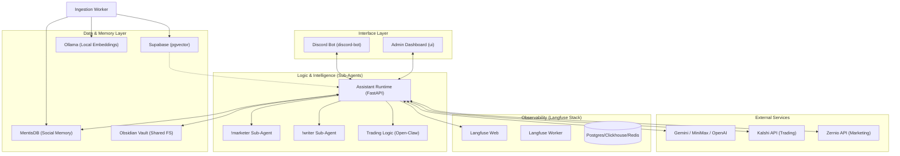

# Arquitectura de Sistema - PC Agent Pro

Esta documentación describe la orquestación completa, los servicios y la jerarquía de inteligencia del PC Agent.

## 1. Diagrama de Orquestación (Master Flow)

## 2. Stack de Servicios (Docker Compose)

El sistema se orquesta mediante **Docker Compose**, dividiéndose en los siguientes servicios clave:

| Servicio | Puerto | Descripción |
| :--- | :--- | :--- |
| `control-api` | 8000 | Orquestador central y API de administración. |
| `assistant-runtime`| 8100 | Cerebro de los sub-agentes y ejecución de LLM. |
| `discord-bot` | - | Interfaz de usuario principal vía Discord. |
| `ui` | 8080 | Dashboard web para configuración y monitoreo. |
| `obsidian` | 3010 | Interfaz web de Obsidian (KasmVNC) para gestión de notas. |
| `ingestion-worker` | - | Procesos en segundo plano para recolección de tendencias. |
| `supabase-vector-db`| 54322| Almacenamiento vectorial para RAG y conocimiento profundo. |
| `ollama` | 11434| Motor local de embeddings (`mxbai-embed-large`). |
| `mentisdb` | 9471 | Almacenamiento de memoria social y aprendizajes rápidos. |
| `langfuse-*` | 3000 | Stack completo de observabilidad y trazabilidad de LLMs. |

## 3. Jerarquía de Sub-Agentes

El `assistant-runtime` delega la inteligencia en agentes especializados:

*   **!marketer**: LangGraph de marketing con datos Zernio, aprobaciones humanas, drafts, campañas, publicaciones, comentarios, leads, dashboards y memoria.
*   **!writer**: Copywriting creativo, storytelling y blogs con contrato estructurado, persistencia directa en Obsidian y errores seguros cuando falla el storage.
*   **Trading Core**: Ejecuta la lógica de predicción asimétrica y gestión de órdenes en Kalshi.

## 4. Matriz de Modelos

| Tarea | Modelo Principal | Proveedor |
| :--- | :--- | :--- |
| **Razonamiento / Chat** | `gemini-1.5-flash` | Google (Vía Open-Claw) |
| **Embeddings** | `mxbai-embed-large`| Ollama (Local) |
| **Fallback / Research** | `gpt-4o` / `minimax` | OpenAI / MiniMax |

## 5. Capas de Tecnología y Persistencia

1.  **Capa de Entrada**: Discord (Event-driven) y React UI (Polling/Websockets).
2.  **Capa de Aplicación**: FastAPI con Inyección de Dependencias (Hexagonal).
3.  **Capa de Memoria**: 
    *   *Memoria a Largo Plazo*: Supabase (Vectores).
    *   *Memoria de Trabajo*: MentisDB (JSON Store).
    *   *Memoria Documental*: Obsidian (Markdown).
4.  **Capa de Observabilidad**: Langfuse para debugging de cadenas de pensamiento y optimización de costos.

## 6. Contratos Productivos De Writer Y Marketer

### Writer

`WriterWorkflow` soporta `chat`, `blog` y `storytelling`. Cada acción valida el prompt, devuelve salida estructurada y registra la ejecución en memoria cuando existe `MemoryPort`.

Los artefactos Markdown se guardan en Obsidian con rutas relativas (`Blog/...md` o `Story-telling/...md`). Si el contenido se genera pero no puede persistirse, el workflow devuelve `status=error` con `code=writer.persistence_failed`; no se marca como éxito parcial.

### Marketer

El runtime productivo instancia `MarketingGraph` con `ZernioAdapter`. El puerto `MarketingPort` declara las capacidades usadas por el grafo, incluyendo `get_connected_accounts`, lectura de comentarios, dashboard, reportes, drafts, publicaciones, respuestas, DMs, leads, idempotencia y runs de automatización.

Las acciones con escritura externa siguen pasando por políticas de autonomía y aprobación humana. Las rutas legacy ya no deben usarse como fuente demo en producción; si se instancian sin adapter explícito, apuntan al adapter real de Zernio.

## 7. Configuración de Red

Todos los servicios residen en una red interna de Docker, permitiendo la comunicación por hostname (ej: `http://assistant-runtime:8100`). La persistencia se garantiza mediante volúmenes compartidos como `obsidian-vault`, que permite la escritura en tiempo real entre el sub-agente escritor y la interfaz de usuario.
