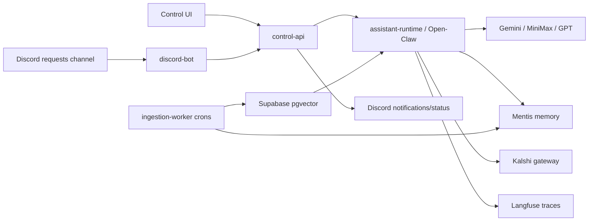

# Arquitectura PC Agent

## Bounded contexts

- `Prediction`: convierte datos de mercado y conocimiento recuperado en hipotesis,
  probabilidades, confianza y razones.
- `Trading`: decide si una prediccion puede convertirse en una operacion Kalshi,
  aplicando limites, riesgo, idempotencia y modo demo/live.
- `Knowledge`: recolecta fuentes, genera embeddings, guarda documentos en Supabase
  y sincroniza memoria util hacia Mentis.
- `Assistant`: coordina conversaciones, herramientas, memoria, proveedores LLM y
  trazas de Langfuse.
- `Ops`: expone estado de servidores, configuracion, canales Discord y salud de
  integraciones.

## Flujo principal



## Capas

```text
domain
  Entidades, value objects y eventos de negocio.

application
  Casos de uso como CheckSystemStatus, RegisterKnowledgeSource,
  VerifyMentisHealth y RouteAssistantRequest.

ports
  Interfaces de salida: KalshiGateway, LlmRouter, MemoryStore,
  EmbeddingKnowledgeBase, ConversationTracer, NotificationSender.

adapters
  Implementaciones concretas para Kalshi, Supabase, Mentis, Langfuse,
  Discord, Open-Claw y proveedores LLM.

api / workers / bots
  Adaptadores de entrada del sistema.
```

## Reglas de frontera

- El dominio no importa SDKs externos.
- Los adaptadores convierten payloads externos a modelos internos.
- Las decisiones de trading viven en `TradingPolicy`, no en Discord, API ni Kalshi.
- Los crons alimentan Supabase primero y luego publican resumen curado hacia Mentis.
- Langfuse observa conversaciones y llamadas a herramientas, pero no decide.
- La publishable key de Supabase queda limitada a lectura/RLS; ingestion y escritura
  requieren service role o conexion Postgres.
- El conocimiento es visible publicamente desde la UI por decision de producto; las
  mutaciones administrativas siguen protegidas por token/backend.
- Toda decision de trading pasa por Discord y requiere aprobacion explicita antes de
  llegar a cualquier adapter Kalshi.
- Los embeddings usan Ollama `mxbai-embed-large` por defecto para mantener una ruta
  local/gratis con vectores de 1024 dimensiones.

## Canales Discord recomendados

- `kalshi-requests`: solicitudes del usuario al asistente.
- `kalshi-ops`: notificaciones de ingestion, prediccion, ordenes y errores.
- `kalshi-status`: health checks, estado de configuracion y disponibilidad.

## Roadmap tecnico

1. Completar credenciales y probar health checks.
2. Implementar adaptador Kalshi demo antes de live trading.
3. Conectar Open-Claw real y router LLM con politicas de costo/modelo.
4. Crear migraciones Supabase para documentos, embeddings y fuentes.
5. Implementar ingestion por fuente con trazas Langfuse.
6. Activar Discord bot con permisos de canal limitados.
7. Agregar aprobacion humana antes de ejecutar ordenes reales.
