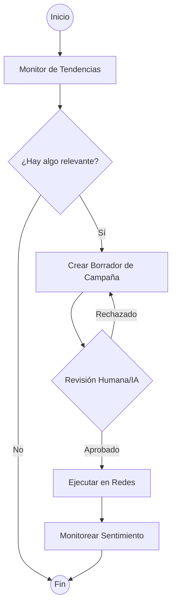

# Mejoras de Experiencia, Memoria y Tool Calling

Este documento detalla las propuestas y el estado actual de las mejoras solicitadas para el sistema de agentes.

## 1. Buena Experiencia (UX)

Para mejorar la interacción entre el usuario y los agentes en Discord/UI:

*   **Interacciones Enriquecidas**:
    *   [x] **Buttons & Menus**: Usados en `!marketer` y aprobaciones.
    *   [x] **Embeds**: Implementados en comandos de ayuda y estados.
*   **Streaming**: Implementar streaming de respuestas para que el usuario vea que el agente está trabajando en tiempo real.
*   **Proactividad**: Que el agente envíe notificaciones cuando encuentre un "Trend" crítico o un "Lead" de alta intención, sin esperar a que el usuario pregunte.

## 2. Memoria Avanzada

Actualmente usamos Supabase y MentisDB. Propuesta de evolución:

*   **Jerarquía de Memoria**:
    *   **Memoria de Trabajo (Contexto)**: Mensajes recientes en la conversación actual (LangChain WindowBuffer).
    *   **Memoria de Corto Plazo (Mentis)**: Aprendizajes del día o semana, recuperados por relevancia.
    *   **Memoria de Largo Plazo (Supabase)**: Base de conocimientos consolidada y perfil del usuario/marca.
*   [x] **Consolidación de Aprendizajes**: Implementado en `MemoryConsolidationService` con cron diario.

## 3. Tool Calling & Agentes Autónomos

### Listado Actual de Herramientas (Marketing):
1.  `respond_to_comments`: Prepara respuestas y solo publica si existe aprobacion y permisos de escritura.
2.  `plan_campaign`: Genera planes de contenido y drafts aprobables.
3.  `research_competitors`: Analiza datos de competencia.
4.  `qualify_leads`: Identifica intención de compra en comentarios.
5.  `process_lead_magnets`: Prepara DMs con recursos; el envio real requiere aprobacion.
6.  `generate_funnel`: Crea estrategias de embudo.
7.  `monitor_trends`: Detecta tendencias virales.
8.  `analyze_sentiment`: Evalúa la reputación de la marca.
9.  `find_collaborations`: Busca influencers y marcas aliadas.
10. `publish_post`: Genera sugerencia de post y publica/programa solo con aprobacion.
11. `generate_post_queue`: Crea cola de posts como drafts aprobables.

### [x] Transición a Tool Calling Nativo:
Implementado en `MarketingGraph` usando el SDK de Gemini. El agente ahora:
*   Decide qué herramienta usar según el prompt o subcomando explícito.
*   Usa `ZernioAdapter` como ruta productiva.
*   Mantiene acciones sensibles detrás de aprobación humana.

## 4. [x] LangGraph en el Proyecto
Implementado el `MarketingGraph` como una máquina de estados con aprobación humana nativa.

LangGraph permitiría pasar de un flujo lineal a uno cíclico y controlado por estado.

### Caso de Uso: Ciclo de Marketing Autónomo

**Ventajas actuales**:
*   **Trazabilidad de pasos**: El grafo separa intención, contexto, revisión, aprobación, ejecución y cierre.
*   **Contratos limpios**: El dominio habla con `MarketingPort` y la integración real vive en `ZernioAdapter`.
*   **Human-in-the-loop**: Las escrituras externas permanecen bloqueadas hasta aprobación y políticas activas.

## 5. Writer Productivo

Writer ya no es solo generación de texto:

*   Valida `chat`, `blog` y `storytelling`.
*   Rechaza prompts vacíos y comandos desconocidos con códigos de error claros.
*   Guarda Markdown en Obsidian con nombres seguros.
*   Registra cada ejecución en memoria cuando el adapter está disponible.
*   Devuelve `writer.persistence_failed` si no puede guardar, evitando falsos éxitos.
*   Sugiere keywords visuales sin insertar assets externos no licenciados.
