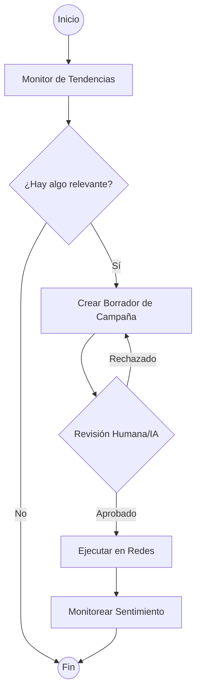

# Mejoras de Experiencia, Memoria y Tool Calling

Este documento detalla las propuestas y el estado actual de las mejoras solicitadas para el sistema de agentes.

## 1. Buena Experiencia (UX)

Para mejorar la interacción entre el usuario y los agentes en Discord/UI:

*   **Interacciones Enriquecidas**:
    *   **Buttons & Menus**: En lugar de solo comandos de texto, usar componentes de Discord para acciones rápidas (ej. `[Aprobar Campaña]`, `[Analizar Sentimiento]`).
    *   **Embeds**: Formatear las respuestas con `Discord Embeds` para mayor legibilidad (títulos, colores por agente, campos organizados).
*   **Streaming**: Implementar streaming de respuestas para que el usuario vea que el agente está trabajando en tiempo real.
*   **Proactividad**: Que el agente envíe notificaciones cuando encuentre un "Trend" crítico o un "Lead" de alta intención, sin esperar a que el usuario pregunte.

## 2. Memoria Avanzada

Actualmente usamos Supabase y MentisDB. Propuesta de evolución:

*   **Jerarquía de Memoria**:
    *   **Memoria de Trabajo (Contexto)**: Mensajes recientes en la conversación actual (LangChain WindowBuffer).
    *   **Memoria de Corto Plazo (Mentis)**: Aprendizajes del día o semana, recuperados por relevancia.
    *   **Memoria de Largo Plazo (Supabase)**: Base de conocimientos consolidada y perfil del usuario/marca.
*   **Consolidación de Aprendizajes**: Un proceso (Cron) que tome las memorias del día, las resuma usando un LLM y las guarde como "Aprendizajes Permanentes" para evitar llenar el contexto con ruido.

## 3. Tool Calling & Agentes Autónomos

### Listado Actual de Herramientas (Marketing):
1.  `respond_to_comments`: Responde automáticamente en IG/TikTok.
2.  `plan_campaign`: Genera planes de contenido.
3.  `research_competitors`: Analiza datos de competencia.
4.  `qualify_leads`: Identifica intención de compra en comentarios.
5.  `process_lead_magnets`: Envía DMs automáticos con recursos.
6.  `generate_funnel`: Crea estrategias de embudo.
7.  `monitor_trends`: Detecta tendencias virales.
8.  `analyze_sentiment`: Evalúa la reputación de la marca.
9.  `find_collaborations`: Busca influencers y marcas aliadas.

### Transición a Tool Calling Nativo:
En lugar de `if/elif` en el código Python, usaremos la capacidad de **Function Calling** de Gemini/OpenAI. Esto permite que el agente:
*   Decida qué herramienta usar según el prompt.
*   Combine herramientas (ej. primero `monitor_trends` y luego `plan_campaign` basado en esa tendencia).

## 4. LangGraph en el Proyecto

LangGraph permitiría pasar de un flujo lineal a uno cíclico y controlado por estado.

### Caso de Uso: Ciclo de Marketing Autónomo

**Ventajas**:
*   **Persistencia de Estado**: El grafo sabe en qué paso se quedó si el servicio se reinicia.
*   **Multi-Agente**: Un nodo puede ser el "Marketer" y otro el "Copywriter" o "Designer".
*   **Human-in-the-loop**: Capacidad de pausar la ejecución esperando aprobación en Discord.
